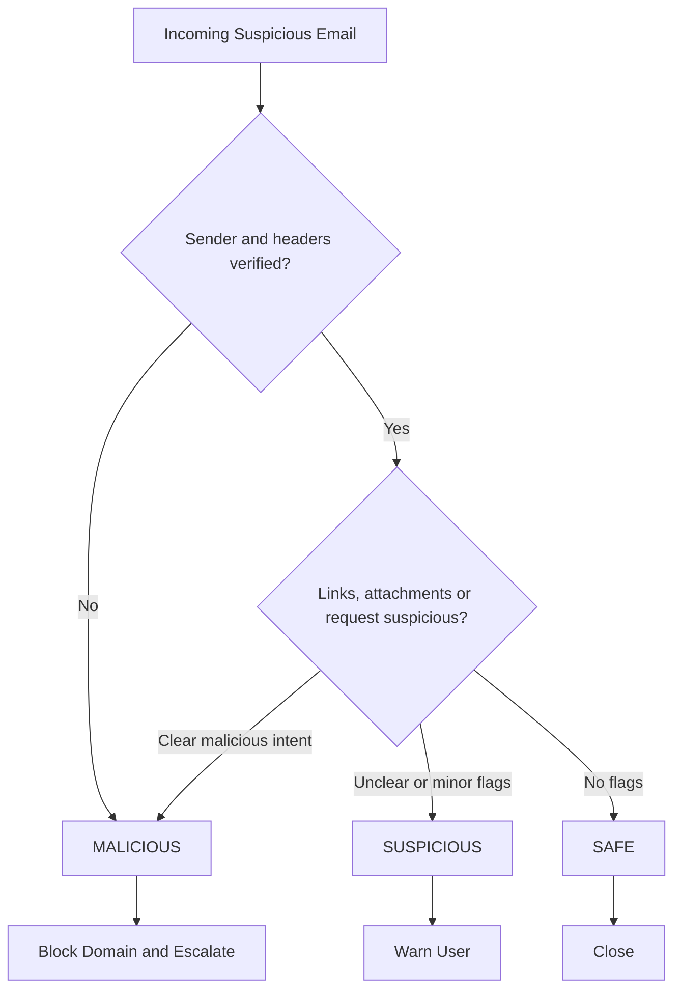

# Phishing Awareness Analysis

**DecodeLabs Cyber Security | Industrial Training Kit | Project 3 | Batch 2026**

> Analyze sample emails and messages to identify phishing attempts, list their red flags, and explain why they are unsafe.

## Overview
Technical firewalls cannot compensate for human error. This project builds the **Human Firewall**: a set of analyses, checklists and procedures that let anyone, expert or not, triage a suspicious message and end in a clear action.

**Skills demonstrated:** threat analysis, awareness of cyber attacks, security thinking.

## Requirements and where they are covered
| Requirement | Location |
|-------------|----------|
| Identify suspicious links or keywords | [docs/01-sample-analysis.md](docs/01-sample-analysis.md) |
| List red flags found in phishing messages | [docs/02-red-flag-master-list.md](docs/02-red-flag-master-list.md) |
| Explain why each message is unsafe | [docs/01-sample-analysis.md](docs/01-sample-analysis.md) |
| URL check procedure | [docs/03-url-check-sop.md](docs/03-url-check-sop.md) |
| Header check procedure (From / Return-Path) | [docs/04-header-check-sop.md](docs/04-header-check-sop.md) |
| Non-expert triage checklist | [docs/05-triage-checklist.md](docs/05-triage-checklist.md) |
| Decision tree with definitive actions | [docs/06-decision-tree.md](docs/06-decision-tree.md) |

## Sample results
| # | Sample | Type | Verdict | Action |
|---|--------|------|---------|--------|
| 1 | [Fake Microsoft alert](samples/sample1-fake-microsoft.txt) | Mass phishing | Malicious | Block and escalate |
| 2 | [CEO wire request](samples/sample2-ceo-wire.txt) | BEC / whaling | Malicious | Block and escalate |
| 3 | [Parcel SMS](samples/sample3-smishing.txt) | Smishing | Malicious | Report and delete |
| 4 | [Subscription renewal](samples/sample4-callback-toad.txt) | Callback (TOAD) | Malicious | Block and report |
| 5 | [Q3 status update](samples/sample5-safe-internal.txt) | Routine internal | Safe | Close |

## Triage decision tree


## Golden rule: Pause, Verify, Report
1. **Pause:** recognize the trigger (urgency, fear, authority) and stop interacting.
2. **Verify:** confirm through a separate channel, such as a known directory number.
3. **Report:** use the report-phishing button. Do not just delete.

## Bonus tool
[`tools/phish_check.py`](tools/phish_check.py) is a small script that flags urgent keywords, shortened URLs and lookalike domains in a text file.
```bash
python tools/phish_check.py samples/sample1-fake-microsoft.txt
```

## Disclaimer
All samples and domains are fictional and for educational purposes only.

## Author
Your Name | Cyber Security Intern, DecodeLabs (Batch 2026)
