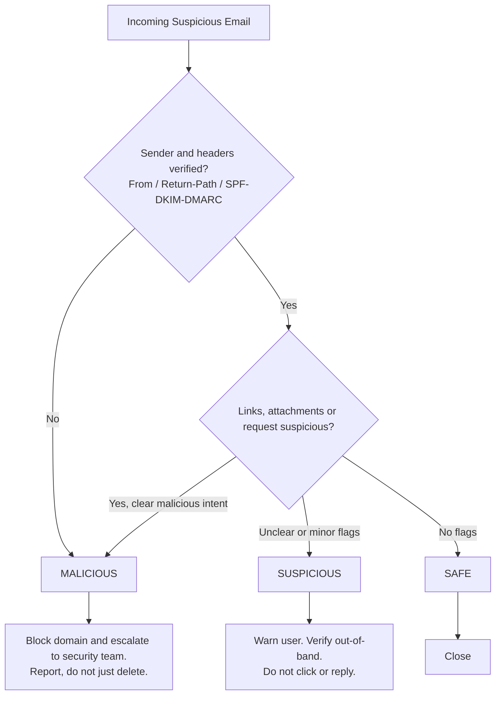

# 06 - Decision Tree

## Actionable outcomes
| Classification | Action |
|----------------|--------|
| Safe | **Close** |
| Suspicious | **Warn User** and verify through a separate channel |
| Malicious | **Block Domain and Escalate** |

## Pause, Verify, Report
1. **Pause:** recognize the cognitive trigger and stop interacting. Apply the Five-Minute Rule.
2. **Verify:** confirm through a secondary channel, such as a call to a known directory number.
3. **Report:** use the report-phishing button. Reporting lets security purge the threat from other inboxes.
